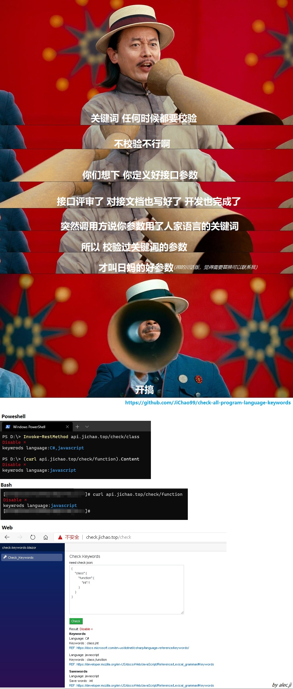

# check-all-program-language-keywords

check all program language keywords, savewords

## Use

### Powershell

```powershell
 Invoke-RestMethod api.jichao.top/check/{word}
```

OR

```ps
(curl api.jichao.top/check/{word}).Content
```

### Bash

```batch
curl api.jichao.top/check/{word}
```

## TODO

- [ ] support swagger
- [x] use System.Text.Json not Newtonsoft.Json
- [x] [gitee site](https://checkkeywords.gitee.io)
- [x] **classlibray use json file**
- [ ] add program language keywords/saveWords

## Program Language

- C#
- javaScript


